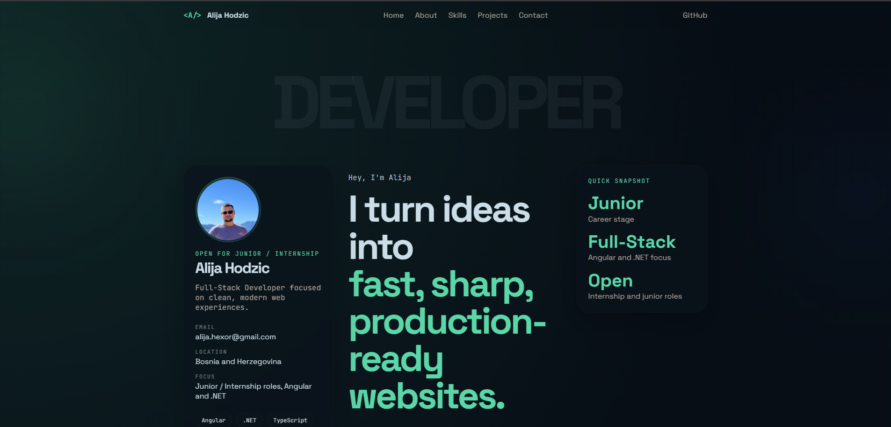
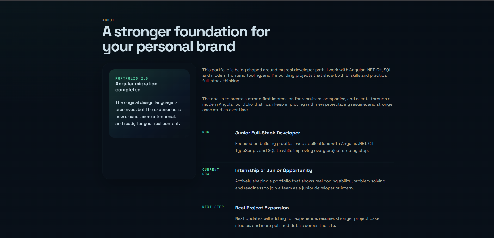
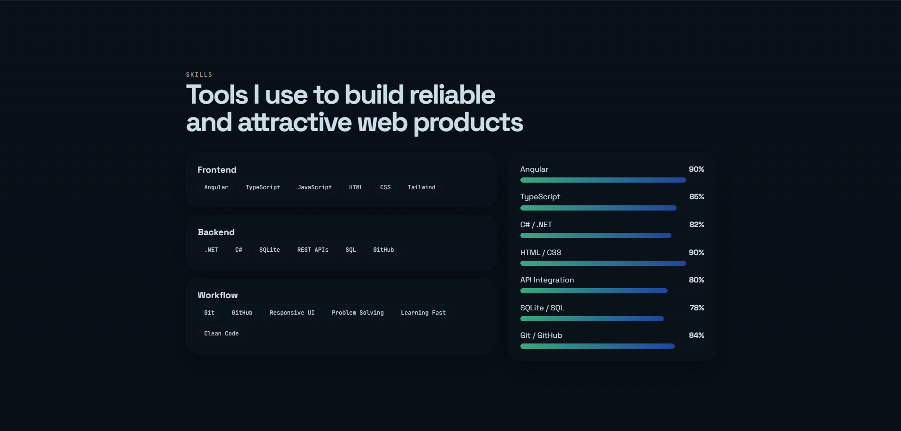
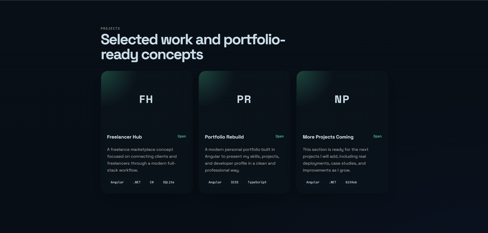
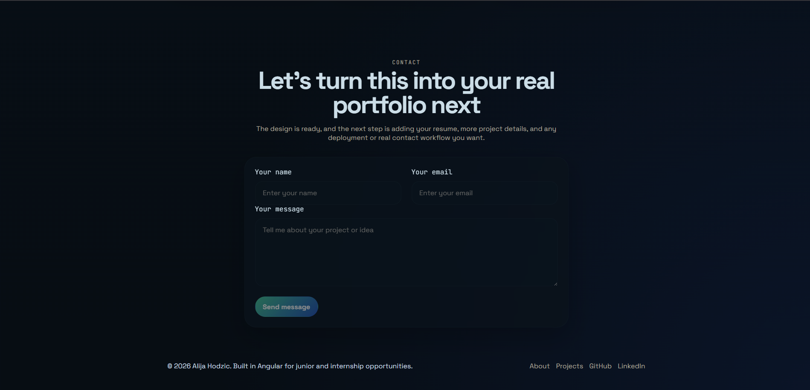

# Alija Hodzic Portfolio

Modern personal portfolio built with Angular, TypeScript, and SCSS.

## Live Demo

[alija-portofolio.vercel.app](https://alija-portofolio.vercel.app/)

## Overview

This portfolio is designed to present my developer profile, technical skills, featured projects, and contact information in a clean and modern format.

## Tech Stack

- Angular
- TypeScript
- SCSS
- HTML
- Vercel

## Features

- Responsive single-page portfolio
- Personal hero section with profile image
- About, skills, projects, and contact sections
- Custom browser tab title and favicon
- Clean dark UI with modern gradients and cards

## Screenshots

### Hero



### About



### Skills



### Projects



### Contact



## Run Locally

```bash
npm install
npm start
```

Open `http://localhost:4200/` in your browser.

## Build

```bash
npm run build
```

## Contact

- Email: [alija.hexor@gmail.com](mailto:alija.hexor@gmail.com)
- GitHub: [github.com/AlijaHodzic](https://github.com/AlijaHodzic)
- LinkedIn: [linkedin.com/in/alijahodzic](https://www.linkedin.com/in/alijahodzic/)
